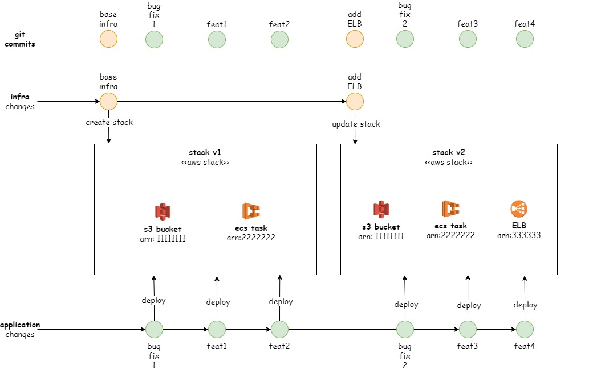
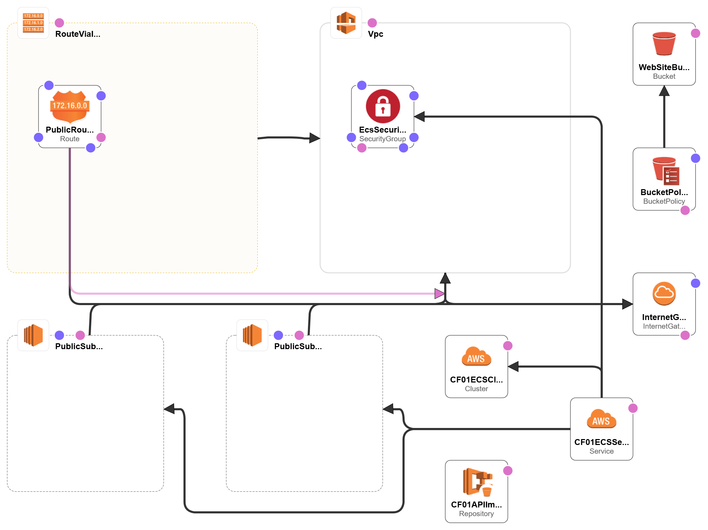

# CI/CD Pipeline using Github Actions to build and deploy an Angular (as AWS S3 Website) + Spring Boot (as AWS Fargate Task) app [including CloudFormation for IaC]

## Repository Organization
* `/web-frontend` - Angular app that you can build running `ng build`
* `/api-service` - Spring Boot app that you can build runing `mvnw package`
* `/aws` - Contains the `cloudformation-template.yml` and some useful `aws-cli` commands to rememeber
* `/.github/workflows` - contains the Github Actions pipeline files

## CI/CD Pipeline Design

This pipeline was designed to be more didatic then "real life". The main reason is that I'd like to highlight the difference between **infrastruture changes** and **application changes**.

The following workflow represents a common interaction between the the infrastructure deployment (and its artifacts) and the application deployment:



It's expected that many app deployments are performed on each infrastructure version.

It's possible to use many different strategies to manage that (e.g.: **always-check-and-update-everything**), I prefered do somenthing more controlled and **branch-driven**, I explain:
* on ``PUSH`` events on ``infra`` branch: update only the infrastructure (use Cloudformation to update stack)
* on ``PUSH`` events on ``main`` branch: update only the application (re-deploy  frontend and backend apps)

### Infra workflow ( see ``/.github/workflows/infra.yml``)

This workflow has only one job (**infra-update**) tha basically run the command:
```
aws cloudformation update-stack --stack-name STACKNAME --template-body cloudformation-template.yml
```
See the diagram os the ``/aws/cloudformation-template.yml``:



### API Service (backend) workflow ( see ``/.github/workflows/apiservice.yml``)

This workflow has two jobs:
* ``build``:
    * build the Angular application (``ng build``)
    * zip the ``dist`` folder and store as artifact 

* ``deploy``:
    * dowload and unzip the zipped ``dist`` (stored on the ``build`` step)
    * dinamically find the bucket ID using AWS CLI (e.g.: ``aws cloudformation describe-stack-resource --stack-name cf01 --logical-resource-id WebSiteBucket --query StackResourceDetail.PhysicalResourceId --output text``)
    * Sync ``dist`` content with de S3 bucket

### Web Frontend workflow ( see ``/.github/workflows/webfrontend.yml``)

This workflow has two jobs: